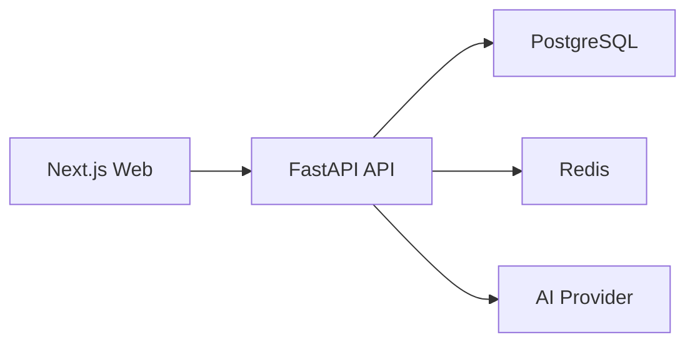

# 03. 설계서

## Architecture

## API

| Method | Path | 설명 |
| --- | --- | --- |
| POST | `/auth/register` | 회원가입 |
| POST | `/auth/login` | 로그인 |
| GET | `/auth/me` | 내 정보 |
| GET | `/notes` | 노트 목록 |
| POST | `/notes` | 노트 생성 |
| GET | `/notes/{id}` | 노트 상세 |
| PATCH | `/notes/{id}` | 노트 수정 |
| DELETE | `/notes/{id}` | 노트 삭제 |
| POST | `/notes/{id}/summarize` | 요약 생성 |
| POST | `/notes/{id}/questions` | 질문 생성 |
| GET | `/dashboard/summary` | 대시보드 요약 |

## Auth

- MVP는 이메일과 비밀번호를 사용한다.
- 비밀번호는 해시로 저장한다.
- 로그인 응답은 bearer token을 반환한다.

## UI

- 첫 화면은 앱 작업 화면이다.
- 대시보드, 노트 목록, 편집 패널을 한 화면에서 확인한다.
- 문구는 `새 노트`, `저장`, `요약`, `질문 생성`, `삭제`처럼 기능 라벨로 제한한다.

## Deployment

- 로컬: Docker Compose
- 초기 AWS: EC2에서 Docker Compose 실행
- 고도화: PostgreSQL은 RDS, Redis는 ElastiCache로 분리 검토

